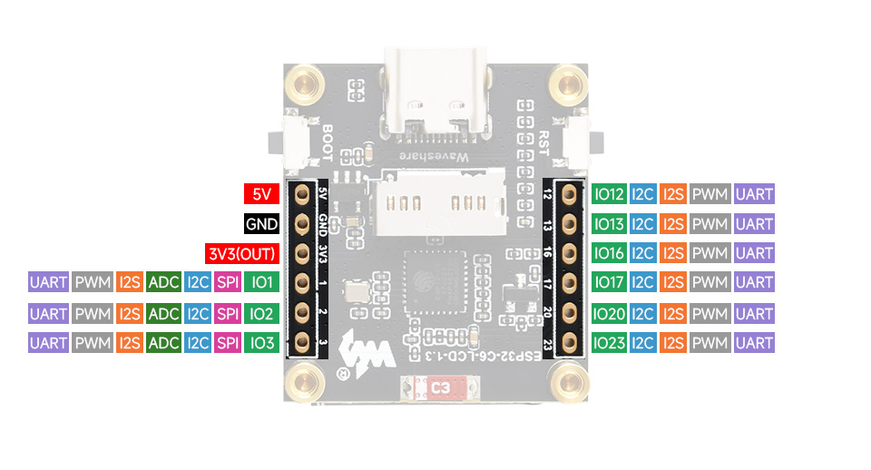

# A Smart Light the Size of a Stamp: Building My Own Matter Lamp

*How a tiny circuit board became a colour-changing light that Home Assistant
treats just like one from the shop, and what I learned along the way.*

---

## The idea

Smart home gadgets have a reputation for being fussy. One brand's bulb needs
its own app, another needs its own hub, and getting them to cooperate takes an
afternoon of trial and error. **Matter** is the industry's attempt to fix that.
It is a shared language that Apple, Google, Amazon, Samsung and many others
have agreed to speak, so that a Matter device works with any Matter-compatible
home system.

I wanted to see how much it takes to build a Matter device from scratch. The
result is a light: a board about the size of a postage stamp with a single
colour LED on it. You plug it into a USB charger and it shows up in Home
Assistant (the open-source home automation system I use) as a proper
full-colour smart lamp.

It is a deliberately small project, the "hello world" of smart lights. Small
as it is, it does everything a commercial bulb does.

## What it can do

From the Home Assistant app, the light behaves like any other smart bulb:

- **Turn it on and off**, from your phone, a dashboard, or an automation
  ("switch on at sunset").
- **Pick any colour** from a colour wheel.
- **Choose a shade of white**, from a warm candle-like glow to a cool
  daylight blue. The light works out the matching colour itself, the same way
  "warm white" bulbs do.
- **Dim it** with a brightness slider.

It also does a few things that are easy to take for granted:

- **There's a real button.** The board has a small physical button, and a
  short press switches the light on or off. Pressing the button and tapping
  the app change the same setting, so the two always agree. If you switch the
  light off by hand, the app shows it as off straight away.
- **Colours fade instead of jumping.** When you change colour, the light
  glides to the new one over about half a second. Dragging your finger around
  the colour wheel looks smooth instead of flickering.
- **It remembers how you left it.** After a power cut the light comes back on
  in the same state as before: on or off, the same brightness, the same
  colour.
- **It updates itself.** New versions of the software are sent to the light
  over the air, so I never need to plug it into a computer again. If an
  update goes wrong, it automatically goes back to the version that worked.

## How it talks to the rest of the house

The light doesn't use Wi-Fi. It uses **Thread**, a low-power wireless network
designed for smart home devices. Thread is a *mesh* network: instead of every
gadget shouting across the house to one router, devices pass messages along
to each other, like a bucket brigade. The more Thread devices you have, the
stronger and further-reaching the network gets.

Because this light is always plugged in, it acts as one of those relays. It
stays awake all the time and helps carry messages for other devices nearby,
such as battery-powered sensors that spend most of their time asleep to save
power.

Adding it to the home is the normal Matter routine. The first time it starts,
it gives you a short pairing code. You type that code into Home Assistant and
the light joins the network. Commercial devices print this code on a sticker
or show it on a screen. My board has a screen, but I left it switched off, so
the code appears on the computer it's connected to during setup.

## Things that surprised me

Getting a light to change colour turned out to be the easy part. Making it
behave like a well-made product took most of the work. A few examples:

**The light kept "forgetting" its colour after a power cut.** At first it
came back switched off. Once that was fixed, it came back at its dimmest
setting. After that, it came back bright white no matter what colour I'd
chosen. The cause was the same each time: the software framework I build on
has settings that say "on power-up, always start like *this*", and by default
they force a fixed value. Telling all three of them to "start like last time"
instead solved it for good.

**Sleeping saves battery but makes a slow light.** I based this project on
an earlier one of mine, a battery-powered plant sensor. To make its batteries
last, that sensor sleeps and only checks for messages every so often. I
carried that over without thinking, and the light sometimes took up to 20
seconds to respond. Nobody wants a light switch with a 20-second delay. Since
the light is always plugged in, I made it stay awake, and now it reacts
straight away.

**Colours on a screen aren't colours in a LED.** Home Assistant describes
colours in a way that's designed around human vision. The LED only
understands "this much red, this much green, this much blue". Converting
between the two, and working out what "warm white" looks like in red, green
and blue, took more care than I expected.

**A button and an app have to agree.** An early version had the button
flipping a separate on/off switch in Home Assistant that wasn't connected to
the light at all. Now the button and the app control the same thing, which
is how anyone would expect a light to work.

## Updating without cables

The most recent addition is wireless updates. When I release a new version,
one command on my computer prepares it and sends it to every light I've set
up. Each light downloads the update in the background over Thread, which
takes a few minutes, and restarts itself into the new version.

The safety net is what I like most. The light keeps its old software stored
next to the new one. If the new version fails to start properly, the light
falls back to the old version on its own. A bad update can't leave you with a
dead lamp.

## Why bother?

You can buy a Matter colour bulb for less than the cost of this board. But
building one yourself shows you what's going on inside the products you buy:
how they join your network, why some react instantly and others lag, why
some forget their settings after a power cut, and how they update safely.

Because it all runs on Matter, none of it is tied to one company. The same
light could be added to Apple Home, Google Home or Amazon Alexa just as
easily as Home Assistant. It answers to whatever home system you use.

---

*The project is open source. If you'd like to build your own, the
[README](../README.md) has the full instructions, and the
[changelog](../CHANGELOG.md) tells the story of how it grew, one fix at a
time.*
