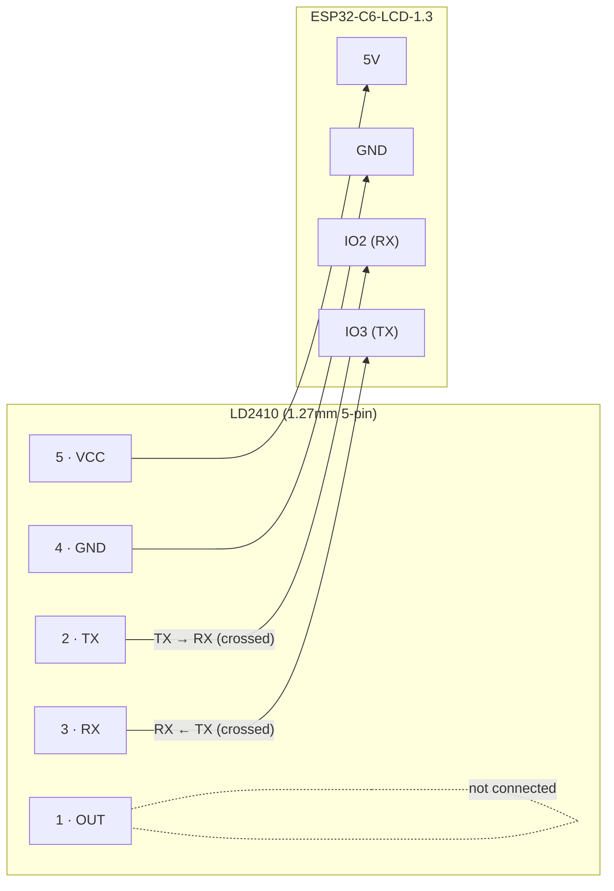

# LD2410 wiring

Sensor connector is a 1.27mm 5-pin header (`sensor.png`); board pinout is the
Waveshare ESP32-C6-LCD-1.3's broken-out headers (`board.png`). Only nine GPIOs
are broken out on this board; IO16/IO17 look tempting (adjacent, UART-capable)
but are this board's console UART0 pins — wiring the radar there crash-loops
the boot. IO2/IO3 are used instead, set via the `esp32-ld2410` component's own
Kconfig (`CONFIG_LD2410_UART_TX`/`CONFIG_LD2410_UART_RX` in
`sdkconfig.defaults`), not `board_pins.h`.

**Crossed, not same-name-to-same-name**: sensor TX (pin 2) wires to the
board's RX pin (IO2); sensor RX (pin 3) wires to the board's TX pin (IO3).
This is normal for UART — each side's TX drives the other side's RX.

| Sensor pin | Signal | Board pin | Note |
|---|---|---|---|
| 1 | OUT | — | not used; UART carries presence instead |
| 2 | TX | IO2 (`CONFIG_LD2410_UART_RX`) | 3.3 V logic, no level shifter needed |
| 3 | RX | IO3 (`CONFIG_LD2410_UART_TX`) | |
| 4 | GND | GND | common ground required |
| 5 | VCC | 5V (or 3V3(OUT)) | module regulates internally |

256000 baud, 8N1 (the sensor label's "2560001 stop bit" is an OCR artifact —
this is the standard LD2410 default).
